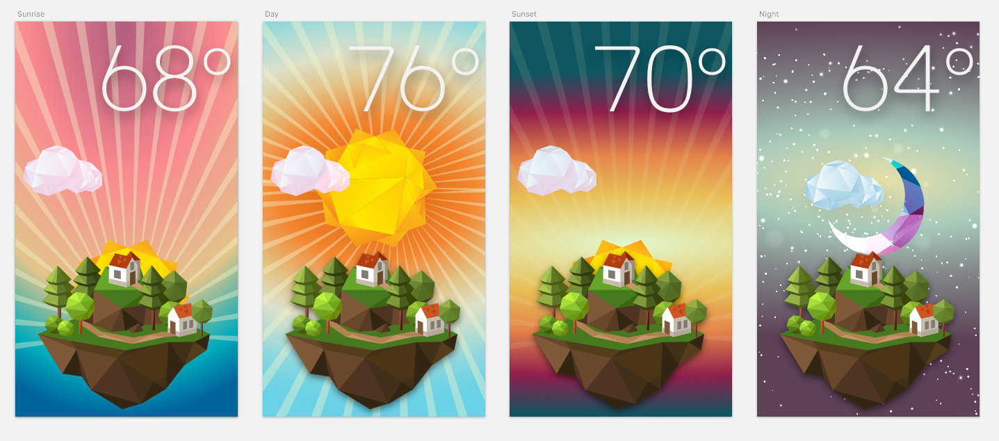

# WTHR
Visual weather app for Front End 2 class project at Make School Product College.

Using the OpenWeather.org API to create a modern weather app that is accessible to all platforms via web using only front-end technologies.

####Initial Sketch Design

Visit [http://thewthr.com](http://thewthr.com) for the end result.

